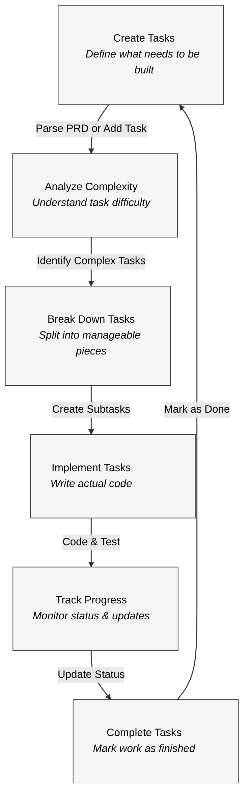
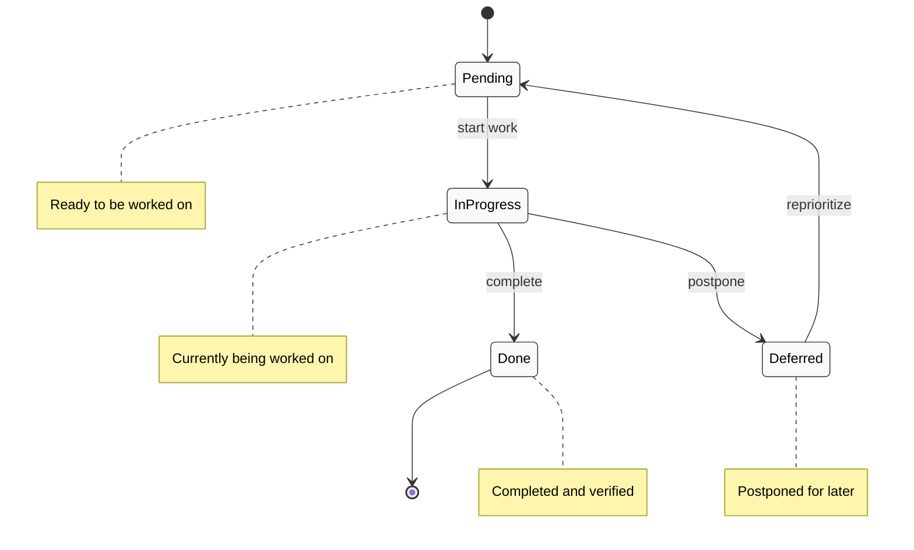

# Cursor Workflow: Quick Start Guide

This is for new cursor users to help keep track of their project.

## What is Cursor Workflow?

Cursor Workflow is a simple yet powerful system that helps you:
- ✅ Break down complex projects into manageable tasks
- ✅ Track your progress through development 
- ✅ Follow consistent coding standards
- ✅ Work effectively with AI assistants like Claude

## Getting Started in 5 Minutes

### Step 1: Install

```bash
# Clone the repository
git clone https://github.com/colours93/cursor_workflow.git

# Install dependencies
cd cursor_workflow
npm install
```

### Step 2: Initialize

Create a `.env` file based on `.env.example`:

```
ANTHROPIC_API_KEY=your_api_key  # Get from https://console.anthropic.com
```

### Step 3: Create Tasks

```bash
# Start with a Product Requirements Document (PRD)
node scripts/dev.js parse-prd --input=your-prd.txt

# Or manually generate an initial task
node scripts/dev.js add-task --prompt="Create a login page"
```

### Step 4: View Your Tasks

```bash
# List all tasks
node scripts/dev.js list

# See what to work on next
node scripts/dev.js next
```

## Daily Workflow

1. **Start your day** with `node scripts/dev.js next` to see what to work on
2. **Analyze complex tasks** with `node scripts/dev.js analyze-complexity`
3. **Break down tasks** with `node scripts/dev.js expand --id=1`
4. **Mark progress** with `node scripts/dev.js set-status --id=1 --status=done`
5. **Review progress** with `node scripts/dev.js list`

## Working with Cursor AI

Cursor Workflow shines when paired with Cursor AI:

1. Open the task with `node scripts/dev.js show --id=1`
2. Copy the task details
3. Paste into Cursor AI with prompt: "Help me implement this task"
4. Cursor AI can use the task context to provide relevant help

## 5 Most Useful Commands

| Command | What it does |
|---------|-------------|
| `node scripts/dev.js next` | Shows what task to work on next |
| `node scripts/dev.js list` | Lists all your tasks |
| `node scripts/dev.js expand --id=1` | Breaks down a task into smaller steps |
| `node scripts/dev.js set-status --id=1 --status=done` | Marks a task as complete |
| `node scripts/dev.js analyze-complexity` | Suggests how to break down complex tasks |

## Visual Guide



The Cursor Workflow process:

1. **Create Tasks**: Define what needs to be done
2. **Analyze Complexity**: Understand task difficulty and scope
3. **Break Down Tasks**: Split complex tasks into manageable subtasks
4. **Implement Tasks**: Do the actual development work
5. **Track Progress**: Monitor and update task status
6. **Complete Tasks**: Finish and verify work, then move to new tasks

## Task Lifecycle



## Need Help?

For a more detailed guide, check out the full [workflow-guide.md](workflow-guide.md) in the docs folder.

---

Happy coding! 🚀 
