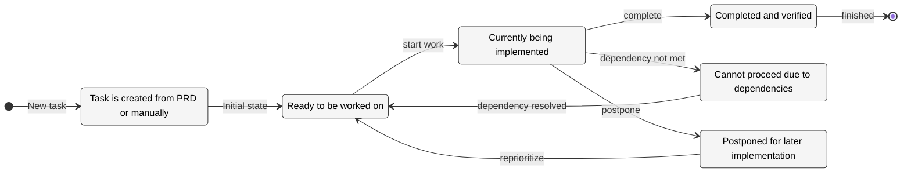
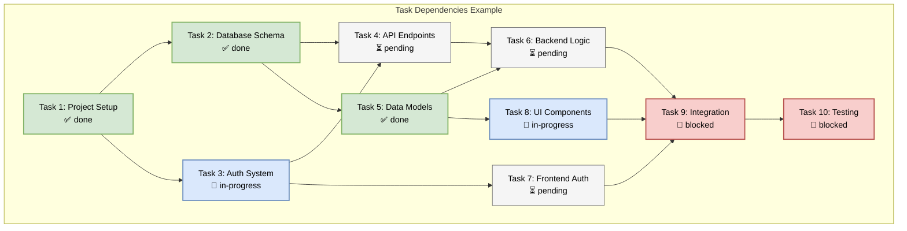
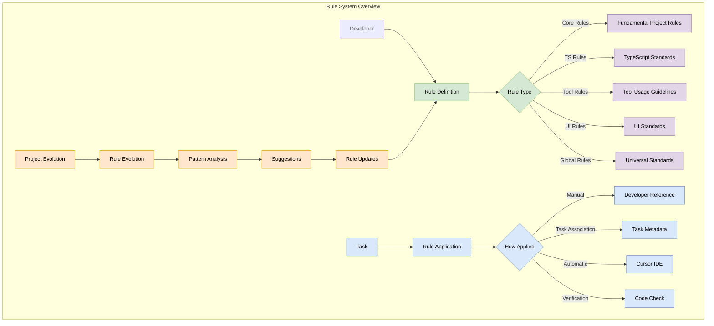
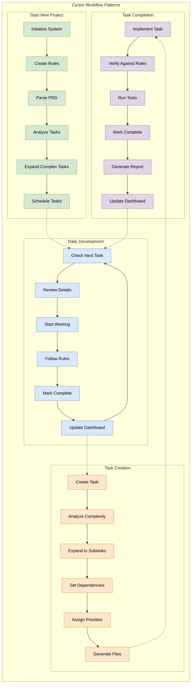

# Comprehensive Cursor Workflow System Guide

This comprehensive guide provides detailed information on using the Cursor Workflow System for task-driven, rule-based development in software projects.

## Table of Contents

1. [Introduction](#introduction)
2. [Core Concepts](#core-concepts)
3. [Installation](#installation)
4. [System Architecture](#system-architecture)
5. [Task Management](#task-management)
   - [Task Structure](#task-structure)
   - [Task Lifecycle](#task-lifecycle)
   - [Task Dependencies](#task-dependencies)
   - [Task Complexity Analysis](#task-complexity-analysis)
   - [Task Scheduling](#task-scheduling)
6. [Rule System](#rule-system)
   - [Rule Structure](#rule-structure)
   - [Rule Categories](#rule-categories)
   - [Rule Application](#rule-application)
   - [Rule Evolution](#rule-evolution)
7. [HTML Reporting](#html-reporting)
   - [Task Reports](#task-reports)
   - [Dashboard](#dashboard)
8. [Command Reference](#command-reference)
   - [Core Commands](#core-commands)
   - [Task Management Commands](#task-management-commands)
   - [Rule Management Commands](#rule-management-commands)
   - [Analysis Commands](#analysis-commands)
   - [Reporting Commands](#reporting-commands)
9. [Workflow Patterns](#workflow-patterns)
   - [Starting a New Project](#starting-a-new-project)
   - [Daily Development Workflow](#daily-development-workflow)
   - [Task Creation and Breakdown](#task-creation-and-breakdown)
   - [Task Completion and Verification](#task-completion-and-verification)
10. [Integration with AI](#integration-with-ai)
    - [Using with Cursor IDE](#using-with-cursor-ide)
    - [AI-assisted Task Expansion](#ai-assisted-task-expansion)
    - [AI-driven Complexity Analysis](#ai-driven-complexity-analysis)
11. [Customization](#customization)
    - [Environment Variables](#environment-variables)
    - [Templates](#templates)
12. [Advanced Features](#advanced-features)
    - [Project Evolution](#project-evolution)
    - [Task Metrics and Analysis](#task-metrics-and-analysis)
13. [Best Practices](#best-practices)
14. [Troubleshooting](#troubleshooting)
15. [Glossary](#glossary)

## Introduction

The Cursor Workflow System is a comprehensive task-driven development framework that integrates task management with rules-based guidance. It is designed to enhance productivity, maintain code quality, and provide structured development workflows, especially for teams using the Cursor IDE with AI-assisted coding.

### Key Benefits

- **Structured Development**: Break down complex projects into manageable tasks with clear dependencies
- **Consistent Code Quality**: Apply development rules systematically across your codebase
- **Progress Tracking**: Monitor project advancement with visual dashboards and progress metrics
- **AI-Enhanced Workflows**: Leverage AI for task breakdown, complexity analysis, and rule adherence
- **Documentation Generation**: Automatically create comprehensive project documentation
- **Process Evolution**: Adapt rules and best practices as your project grows

### Use Cases

- **Individual Developers**: Manage personal projects with structured tasks and self-enforced rules
- **Small Teams**: Coordinate work, maintain coding standards, and track progress
- **AI-Assisted Development**: Maximize the benefits of AI coding assistants by providing clear context
- **Open Source Projects**: Document development standards and onboard new contributors effectively
- **Legacy Code Maintenance**: Track and document incremental improvements to existing codebases

## Core Concepts

The Cursor Workflow System operates on several fundamental concepts:

### Tasks

**Tasks** are discrete units of work that represent specific development activities. Each task has:

- A unique identifier
- Description and details
- Priority and status
- Dependencies on other tasks
- Optional subtasks for complex work
- References to applicable rules

### Rules

**Rules** define development standards, coding conventions, and best practices. They:

- Provide actionable guidance for implementation
- Can be scoped to specific file types or project areas
- Include examples of correct and incorrect usage
- Evolve over time as the project matures

### Workflow

The **workflow** is the process of:

1. Breaking down requirements into tasks
2. Analyzing task complexity and dependencies
3. Scheduling and prioritizing tasks
4. Implementing tasks while following applicable rules
5. Verifying completion and documenting progress
6. Evolving rules based on emerging patterns

## Installation

### Prerequisites

- Node.js (v16.0.0 or higher)
- npm (v7.0.0 or higher)

### Local Installation

```bash
# Clone the repository
git clone https://github.com/colours93/cursor_workflow.git
cd cursor_workflow

# Install dependencies
npm install

# Initialize the workflow system
npm run init
```

### Global Installation

```bash
# Install globally
npm install -g cursor-workflow-system

# Now you can use the CLI from anywhere
cursor-workflow init
```

### Environment Setup

Create a `.env` file in your project root with the following variables:

```
# API Keys (Required for AI-assisted features)
ANTHROPIC_API_KEY=your_anthropic_api_key

# Model Settings
MODEL=claude-3-7-sonnet-20250219
MAX_TOKENS=4000
TEMPERATURE=0.7

# Project Settings
PROJECT_NAME=My Project
PROJECT_VERSION=1.0.0
```

## System Architecture

The Cursor Workflow System consists of several interconnected components:

```mermaid
graph TB
    subgraph "Cursor Workflow System 🚀"
        direction TB
        CLI["⚙️ CLI Interface<br><i>scripts/dev.js</i><br><i>User command entry point</i>"]
        
        Commands["🎮 Command Definitions<br><i>commands.js</i><br><i>Process user commands</i>"]
        
        CLI ---> Commands
        
        subgraph "Core Module System 📦"
            direction TB
            Tasks["📋 Task Management<br><i>tasks.js</i><br><i>Create, update, and track tasks</i>"]
            Rules["📜 Rule System<br><i>rules.js</i><br><i>Define and apply coding standards</i>"]
            Analysis["🔍 Complexity Analysis<br><i>complexity.js</i><br><i>Evaluate task difficulty</i>"]
            Scheduler["📅 Task Scheduling<br><i>scheduler.js</i><br><i>Prioritize and sequence work</i>"]
            Reports["📊 HTML Reporting<br><i>reports.js</i><br><i>Generate visual dashboards</i>"]
            Evolution["🔄 Rule Evolution<br><i>evolution.js</i><br><i>Improve standards over time</i>"]
            Expand["🔀 Task Expansion<br><i>expand.js</i><br><i>Break down complex tasks</i>"]
        end
        
        Commands ---> Tasks
        Commands ---> Rules
        Commands ---> Analysis
        Commands ---> Scheduler
        Commands ---> Reports
        Commands ---> Evolution
        Commands ---> Expand
    end
    
    subgraph "Storage Components 💾"
        direction TB
        TasksJSON["📄 tasks.json<br><i>Main task database</i>"]
        TaskFiles["📑 Task MD Files<br><i>Individual task details</i>"]
        RuleFiles["📝 Rule MDC Files<br><i>Coding standards definitions</i>"]
        HTMLReports["📈 HTML Reports<br><i>Generated visualizations</i>"]
    end
    
    subgraph "External Systems 🌐"
        direction TB
        LLMAPI["🧠 AI Models<br><i>Claude/GPT</i><br><i>Generate content & analysis</i>"]
        IDE["💻 Cursor IDE<br><i>Editor integration</i><br><i>Apply rules while coding</i>"]
    end
    
    Tasks <---> TasksJSON
    Tasks <---> TaskFiles
    Rules <---> RuleFiles
    Reports ---> HTMLReports
    
    Analysis <---> LLMAPI
    Expand <---> LLMAPI
    Evolution <---> LLMAPI
    
    IDE <---> Rules
    IDE <---> Tasks
    
    classDef cliStyle fill:#d5e8d4,stroke:#82b366,stroke-width:3px,color:black,width:600px,padding:25px;
    classDef moduleStyle fill:#dae8fc,stroke:#6c8ebf,stroke-width:3px,color:black,width:600px,padding:25px;
    classDef commandStyle fill:#fff2cc,stroke:#d6b656,stroke-width:3px,color:black,width:600px,padding:25px;
    classDef storageStyle fill:#d5e8d4,stroke:#82b366,stroke-width:3px,color:black,width:500px,padding:25px;
    classDef externalStyle fill:#ffe6cc,stroke:#d79b00,stroke-width:3px,color:black,width:500px,padding:25px;
    classDef subgraphStyle fill:#f5f5f5,stroke:#333,stroke-width:2px,color:black,padding:40px;
    
    class CLI cliStyle;
    class Tasks,Rules,Analysis,Scheduler,Reports,Evolution,Expand moduleStyle;
    class Commands commandStyle;
    class TasksJSON,TaskFiles,RuleFiles,HTMLReports storageStyle;
    class LLMAPI,IDE externalStyle;
```



### Core Modules

The system is organized into modular components:

- **tasks.js**: Core task management functionality
- **rules.js**: Rule definition, loading, and application
- **complexity.js**: Task complexity analysis
- **scheduler.js**: Task scheduling and prioritization
- **reports.js**: HTML report generation
- **evolution.js**: Rule evolution and suggestion
- **expand.js**: Task expansion into subtasks
- **commands.js**: CLI command definitions

These modules work together to provide a cohesive workflow system that handles all aspects of task-driven development.

## Task Management

### Task Structure

Tasks are defined as JSON objects with the following structure:

```json
{
  "id": 1,
  "title": "Implement User Authentication",
  "description": "Create a secure authentication system using OAuth",
  "status": "pending",
  "priority": "high",
  "dependencies": [2, 3],
  "estimatedHours": 8,
  "dueDate": "2025-04-15",
  "details": "Detailed implementation instructions...",
  "testStrategy": "How to verify this task is complete...",
  "applicableRules": ["security.mdc", "typescript_standards.mdc"],
  "subtasks": [
    {
      "id": 1.1,
      "title": "Research OAuth Providers",
      "status": "done",
      "details": "..."
    },
    {
      "id": 1.2,
      "title": "Implement Login Flow",
      "status": "pending",
      "details": "..."
    }
  ]
}
```

Each task is stored in `tasks/tasks.json` and can optionally have a corresponding markdown file at `tasks/task-{id}.md` with more detailed information.

### Task Lifecycle

Tasks move through a defined lifecycle:



1. **Creation**: Tasks are created by parsing a PRD, manually adding them, or breaking down larger tasks
2. **Pending**: Initial state for tasks awaiting implementation
3. **In Progress**: Tasks currently being worked on
4. **Done**: Completed tasks that meet all requirements
5. **Deferred**: Tasks postponed for later implementation
6. **Blocked**: Tasks that cannot proceed due to dependencies or other issues

Transition between states is managed with the `set-status` command:

```bash
cursor-workflow set-status --id=3 --status=in-progress
```

### Task Dependencies

Tasks can depend on other tasks, creating a directed acyclic graph (DAG) of work:



```bash
# Make task 5 dependent on task 3
cursor-workflow add-dependency --id=5 --depends-on=3

# Remove a dependency
cursor-workflow remove-dependency --id=5 --depends-on=3
```

The system maintains dependency integrity and prevents circular dependencies:

```bash
# Validate all dependencies
cursor-workflow validate-dependencies

# Fix invalid dependencies automatically
cursor-workflow fix-dependencies
```

### Task Complexity Analysis

The system can analyze task complexity to help with estimation and breakdown:

```bash
# Analyze all pending tasks
cursor-workflow analyze-complexity

# Analyze a specific task
cursor-workflow analyze-complexity --id=5

# Generate a human-readable report
cursor-workflow complexity-report
```

Complexity analysis considers several factors:

- Description length and detail level
- Number of dependencies
- Technical domain complexity
- Required skills and priority
- Estimated completion time

The analysis produces a complexity score (1-10) and recommends:

- Number of subtasks to create
- Estimated time for completion
- Specialized expertise needed
- Potential risks and challenges

### Task Scheduling

Tasks can be scheduled based on priority, dependencies, and estimated time:

```bash
# Generate a schedule for all pending tasks
cursor-workflow schedule-tasks

# Set priority for a task
cursor-workflow set-priority --id=5 --priority=high

# Set estimated hours
cursor-workflow set-hours --id=5 --hours=8

# Set due date
cursor-workflow set-due --id=5 --date=2025-04-15
```

The scheduler generates a timeline that:

- Respects all task dependencies
- Prioritizes high-priority tasks
- Distributes work evenly
- Accounts for estimated completion time
- Warns about tight deadlines or bottlenecks

## Rule System



### Rule Structure

Rules are defined as markdown files with front matter metadata:

```markdown
---
description: Standards for TypeScript development in the project
globs: **/*.{ts,tsx}
alwaysApply: false
---

# TypeScript Standards

## Critical Rules

- Use explicit types instead of `any`
- Prefer interfaces over type aliases for object types
- Make all API responses use defined types

## Detailed Guidelines

### Type Safety

- Use strict mode in tsconfig.json
- Define interfaces for all data structures
- Use generics for flexible, type-safe components

### Example Implementation

<example>
// Good practice
interface User {
  id: string;
  name: string;
  email: string;
}

function getUser(id: string): Promise<User> {
  // Implementation
}
</example>

<example type="invalid">
// Bad practice
function getUser(id): any {
  // Implementation
}
</example>
```

### Rule Categories

Rules are organized into categories:

- **core-rules/**: Fundamental project rules
- **ts-rules/**: TypeScript-specific standards
- **tool-rules/**: Guidelines for using specific tools
- **ui-rules/**: User interface standards
- **global-rules/**: Rules that apply to all files

### Rule Application

Rules are applied in several ways:

1. **Manual Reference**: Developers consult rules during implementation
2. **Task Association**: Tasks list applicable rules in their metadata
3. **Automatic Application**: The Cursor IDE applies rules based on glob patterns
4. **Verification**: Code can be checked against applicable rules

```bash
# Find rules applicable to a task
cursor-workflow rule-find --task-id=5

# Verify implementation against rules
cursor-workflow verify --task-id=5 --path=src/components/
```

### Rule Evolution

Rules evolve over time as the project grows and practices change:

```bash
# Analyze completed tasks for patterns
cursor-workflow analyze --completed-tasks

# Generate rule update suggestions
cursor-workflow suggest

# Apply a suggested rule update
cursor-workflow apply-suggestion --id=suggestion-1
```

The rule evolution process:

1. Analyzes implementation patterns in completed tasks
2. Identifies recurring patterns not covered by existing rules
3. Detects outdated rules that are no longer followed
4. Suggests updates to existing rules or creation of new rules
5. Provides examples from actual project code

## HTML Reporting

### Task Reports

Generate detailed HTML reports for individual tasks:

```bash
# Generate report for a specific task
cursor-workflow report --id=5

# Specify output location
cursor-workflow report --id=5 --output=reports/task-5.html
```

Task reports include:

- Task details and description
- Current status and priority
- Dependencies and blocking tasks
- Subtask breakdown and progress
- Applicable rules and guidelines
- Implementation notes and test strategy

### Dashboard

Generate a project dashboard showing overall progress:

```bash
# Generate dashboard
cursor-workflow dashboard

# Specify output location
cursor-workflow dashboard --output=reports/dashboard.html
```

The dashboard provides:

- Summary statistics (total tasks, completion percentage)
- Task breakdown by status
- Upcoming deadlines and priorities
- Dependency visualization
- Task completion trends
- Blocked task identification

## Command Reference

### Core Commands

| Command | Description | Example |
|---------|-------------|---------|
| `list` | List all tasks | `cursor-workflow list` |
| `show` | Show task details | `cursor-workflow show --id=3` |
| `next` | Show next task to work on | `cursor-workflow next` |
| `init` | Initialize workflow system | `cursor-workflow init` |
| `generate` | Generate task files | `cursor-workflow generate` |
| `parse-prd` | Parse PRD to generate tasks | `cursor-workflow parse-prd --input=prd.md` |

### Task Management Commands

| Command | Description | Example |
|---------|-------------|---------|
| `set-status` | Update task status | `cursor-workflow set-status --id=3 --status=done` |
| `expand` | Break down task into subtasks | `cursor-workflow expand --id=5 --num=4` |
| `add-dependency` | Add task dependency | `cursor-workflow add-dependency --id=5 --depends-on=3` |
| `remove-dependency` | Remove task dependency | `cursor-workflow remove-dependency --id=5 --depends-on=3` |
| `validate-dependencies` | Check dependency integrity | `cursor-workflow validate-dependencies` |
| `fix-dependencies` | Fix invalid dependencies | `cursor-workflow fix-dependencies` |
| `clear-subtasks` | Remove all subtasks | `cursor-workflow clear-subtasks --id=5` |

### Rule Management Commands

| Command | Description | Example |
|---------|-------------|---------|
| `rule-list` | List all rules | `cursor-workflow rule-list` |
| `rule-show` | Show rule details | `cursor-workflow rule-show --id=typescript_standards` |
| `rule-find` | Find rules for a task | `cursor-workflow rule-find --task-id=5` |
| `verify` | Verify against rules | `cursor-workflow verify --task-id=5 --path=src/` |

### Analysis Commands

| Command | Description | Example |
|---------|-------------|---------|
| `analyze-complexity` | Analyze task complexity | `cursor-workflow analyze-complexity` |
| `complexity-report` | Show complexity report | `cursor-workflow complexity-report` |
| `analyze` | Analyze patterns in tasks | `cursor-workflow analyze --completed-tasks` |
| `suggest` | Suggest rule updates | `cursor-workflow suggest` |
| `apply-suggestion` | Apply rule suggestion | `cursor-workflow apply-suggestion --id=1` |

### Scheduling Commands

| Command | Description | Example |
|---------|-------------|---------|
| `schedule-tasks` | Generate task schedule | `cursor-workflow schedule-tasks` |
| `set-priority` | Set task priority | `cursor-workflow set-priority --id=5 --priority=high` |
| `set-hours` | Set estimated hours | `cursor-workflow set-hours --id=5 --hours=8` |
| `set-due` | Set due date | `cursor-workflow set-due --id=5 --date=2025-04-15` |

### Reporting Commands

| Command | Description | Example |
|---------|-------------|---------|
| `report` | Generate task HTML report | `cursor-workflow report --id=5` |
| `dashboard` | Generate project dashboard | `cursor-workflow dashboard` |

## Workflow Patterns



### Starting a New Project

1. **Initialize the Workflow System**:
   ```bash
   cursor-workflow init
   ```

2. **Create Initial Rules**:
   - Define core rules in `.cursor/rules/`
   - Use rule templates as a starting point

3. **Parse Product Requirements**:
   ```bash
   cursor-workflow parse-prd --input=product-requirements.md
   ```

4. **Analyze Task Complexity**:
   ```bash
   cursor-workflow analyze-complexity
   ```

5. **Expand Complex Tasks**:
   ```bash
   cursor-workflow expand --id=1 --research
   ```

6. **Generate Task Schedule**:
   ```bash
   cursor-workflow schedule-tasks
   ```

### Daily Development Workflow

1. **Check Next Task**:
   ```bash
   cursor-workflow next
   ```

2. **Review Task Details**:
   ```bash
   cursor-workflow show --id=5 --with-rules
   ```

3. **Start Working on Task**:
   ```bash
   cursor-workflow set-status --id=5 --status=in-progress
   ```

4. **Implement Following Rules**:
   - Reference applicable rules during development
   - Use Cursor IDE to automatically apply rules

5. **Mark Task as Complete**:
   ```bash
   cursor-workflow set-status --id=5 --status=done
   ```

6. **Generate Updated Dashboard**:
   ```bash
   cursor-workflow dashboard
   ```

### Task Creation and Breakdown

1. **Create a New Task**:
   ```bash
   cursor-workflow add-task --prompt="Implement user profile page"
   ```

2. **Analyze Complexity**:
   ```bash
   cursor-workflow analyze-complexity --id=5 --research
   ```

3. **Expand into Subtasks**:
   ```bash
   cursor-workflow expand --id=5 --num=4 --research
   ```

4. **Set Dependencies**:
   ```bash
   cursor-workflow add-dependency --id=5.1 --depends-on=3
   ```

5. **Assign Priorities**:
   ```bash
   cursor-workflow set-priority --id=5.1 --priority=high
   ```

6. **Generate Task Files**:
   ```bash
   cursor-workflow generate
   ```

### Task Completion and Verification

1. **Implement the Task**:
   - Follow requirements and applicable rules
   - Implement all necessary subtasks

2. **Verify Against Rules**:
   ```bash
   cursor-workflow verify --task-id=5 --path=src/components/profile/
   ```

3. **Run Test Strategy**:
   - Execute tests as defined in the task
   - Ensure all acceptance criteria are met

4. **Mark Task Complete**:
   ```bash
   cursor-workflow set-status --id=5 --status=done
   ```

5. **Generate Task Report**:
   ```bash
   cursor-workflow report --id=5
   ```

6. **Update Project Dashboard**:
   ```bash
   cursor-workflow dashboard
   ```

## Integration with AI

### Using with Cursor IDE

The Cursor Workflow System integrates seamlessly with the Cursor IDE:

1. **Rule Access**: Cursor AI can access and apply rules from `.cursor/rules/`
2. **Task Context**: The AI can use task details to understand requirements
3. **Code Generation**: Generate code that follows project-specific rules
4. **Automated Verification**: Check if generated code complies with rules

### AI-assisted Task Expansion

Use AI to break down complex tasks:

```bash
# Expand with AI assistance
cursor-workflow expand --id=5 --research

# Provide additional context
cursor-workflow expand --id=5 --prompt="Focus on Redux integration"
```

The AI will:
1. Analyze the task description and details
2. Research relevant technical approaches
3. Create logical subtasks with detailed instructions
4. Suggest implementation patterns based on rules

### AI-driven Complexity Analysis

AI can analyze task complexity:

```bash
# Analyze with AI
cursor-workflow analyze-complexity --research
```

The AI considers:
- Task description semantics
- Technical domain knowledge
- Implementation patterns
- Dependencies and prerequisites
- Similar tasks from the past

## Customization

### Environment Variables

Customize system behavior with environment variables:

```
# API Keys
ANTHROPIC_API_KEY=your_api_key

# LLM Settings
MODEL=claude-3-7-sonnet-20250219
MAX_TOKENS=4000
TEMPERATURE=0.7

# Default Values
DEFAULT_SUBTASKS=3
DEFAULT_PRIORITY=medium
DEFAULT_ESTIMATED_HOURS=4

# Project Info
PROJECT_NAME=My Amazing Project
PROJECT_VERSION=1.0.0
```

These can be set in a `.env` file or in your environment.

### Templates

Customize templates for:

- **Task Files**: Modify `templates/task-template.md`
- **Rule Files**: Modify `templates/rule-template.mdc`
- **HTML Reports**: Customize HTML generation in `scripts/modules/reports.js`

## Advanced Features

### Project Evolution

The system can help evolve project standards over time:

1. **Pattern Analysis**:
   ```bash
   cursor-workflow analyze --completed-tasks --last=20
   ```

2. **Rule Suggestions**:
   ```bash
   cursor-workflow suggest
   ```

3. **Review Suggestions**:
   - Review suggested rule changes
   - Modify if necessary

4. **Apply Updates**:
   ```bash
   cursor-workflow apply-suggestion --id=suggestion-1
   ```

This creates a feedback loop where project standards evolve based on actual implementation patterns.

### Task Metrics and Analysis

Gather insights about your development process:

```bash
# Generate a metrics report
cursor-workflow metrics-report
```

This provides:
- Average completion time by priority
- Dependency chain lengths
- Complexity distribution
- Rule adherence statistics
- Task breakdown patterns

## Best Practices

### Task Management

1. **Right-sized Tasks**: Create tasks that take 1-2 days to complete
2. **Clear Dependencies**: Make dependencies explicit and avoid circular references
3. **Detailed Descriptions**: Include enough detail for anyone to understand the task
4. **Testable Completion**: Define clear verification criteria
5. **Regular Updates**: Keep task status up to date

### Rule Creation

1. **Actionable Guidelines**: Rules should provide clear, specific guidance
2. **Practical Examples**: Include real-world examples from your codebase
3. **Reasonable Scope**: Keep rules focused on specific domains or file types
4. **Clear Applicability**: Define when rules should be applied
5. **Regular Updates**: Evolve rules as project needs change

### Workflow Process

1. **Consistent Process**: Follow the same workflow for all tasks
2. **Regular Reviews**: Generate and review dashboards weekly
3. **Documentation**: Update task details and documentation as you progress
4. **Progressive Refinement**: Start simple and add detail as needed
5. **Feedback Loop**: Use metrics to improve your process

## Troubleshooting

### Common Issues

1. **Dependency Errors**:
   - Run `cursor-workflow validate-dependencies` to find issues
   - Use `cursor-workflow fix-dependencies` to resolve them

2. **Task File Inconsistencies**:
   - Regenerate task files with `cursor-workflow generate`
   - Check for JSON syntax errors in tasks.json

3. **Rule Application Problems**:
   - Verify rule globs are correctly defined
   - Check that rules are referenced in applicable tasks

4. **Command Not Found**:
   - Ensure the system is properly installed
   - Check that dependencies are installed with `npm install`

5. **AI Integration Issues**:
   - Verify API keys are correctly set in .env
   - Check network connectivity for AI services

### Getting Help

- Check the documentation in the `docs/` directory
- Review error messages for specific guidance
- Check for updates in the GitHub repository

## Glossary

- **Task**: A discrete unit of work to be implemented
- **Subtask**: A smaller component of a larger task
- **Rule**: A development guideline or standard
- **Dependency**: A relationship where one task requires another to be completed first
- **Complexity**: A measure of how difficult a task is to implement
- **Priority**: The relative importance of a task
- **Status**: The current state of a task in its lifecycle
- **Glob Pattern**: A pattern used to match file paths
- **Front Matter**: Metadata at the beginning of a markdown file
- **Critical Rule**: An essential guideline that must be followed
- **Verification**: The process of checking if a task meets requirements
- **Schedule**: A timeline for task completion
- **Dashboard**: A visual representation of project status 