# Comprehensive Cursor Workflow System Guide

This comprehensive guide provides detailed information on using the Cursor Workflow System for task-driven, rule-based development in software projects.

## Table of Contents

1. [Introduction](#introduction)
2. [Core Concepts](#core-concepts)
3. [Installation](#installation)
4. [System Architecture](#system-architecture)
5. [Task Management](#task-management)
   - [Task Structure](#task-structure)
   - [Task Lifecycle](#task-lifecycle)
   - [Task Dependencies](#task-dependencies)
   - [Task Complexity Analysis](#task-complexity-analysis)
   - [Task Scheduling](#task-scheduling)
6. [Rule System](#rule-system)
   - [Rule Structure](#rule-structure)
   - [Rule Categories](#rule-categories)
   - [Rule Application](#rule-application)
   - [Rule Evolution](#rule-evolution)
7. [HTML Reporting](#html-reporting)
   - [Task Reports](#task-reports)
   - [Dashboard](#dashboard)
8. [Command Reference](#command-reference)
   - [Core Commands](#core-commands)
   - [Task Management Commands](#task-management-commands)
   - [Rule Management Commands](#rule-management-commands)
   - [Analysis Commands](#analysis-commands)
   - [Reporting Commands](#reporting-commands)
9. [Workflow Patterns](#workflow-patterns)
   - [Starting a New Project](#starting-a-new-project)
   - [Daily Development Workflow](#daily-development-workflow)
   - [Task Creation and Breakdown](#task-creation-and-breakdown)
   - [Task Completion and Verification](#task-completion-and-verification)
10. [Integration with AI](#integration-with-ai)
    - [Using with Cursor IDE](#using-with-cursor-ide)
    - [AI-assisted Task Expansion](#ai-assisted-task-expansion)
    - [AI-driven Complexity Analysis](#ai-driven-complexity-analysis)
11. [Customization](#customization)
    - [Environment Variables](#environment-variables)
    - [Templates](#templates)
12. [Advanced Features](#advanced-features)
    - [Project Evolution](#project-evolution)
    - [Task Metrics and Analysis](#task-metrics-and-analysis)
13. [Best Practices](#best-practices)
14. [Troubleshooting](#troubleshooting)
15. [Glossary](#glossary)

## Introduction

The Cursor Workflow System is a comprehensive task-driven development framework that integrates task management with rules-based guidance. It is designed to enhance productivity, maintain code quality, and provide structured development workflows, especially for teams using the Cursor IDE with AI-assisted coding.

### Key Benefits

- **Structured Development**: Break down complex projects into manageable tasks with clear dependencies
- **Consistent Code Quality**: Apply development rules systematically across your codebase
- **Progress Tracking**: Monitor project advancement with visual dashboards and progress metrics
- **AI-Enhanced Workflows**: Leverage AI for task breakdown, complexity analysis, and rule adherence
- **Documentation Generation**: Automatically create comprehensive project documentation
- **Process Evolution**: Adapt rules and best practices as your project grows

### Use Cases

- **Individual Developers**: Manage personal projects with structured tasks and self-enforced rules
- **Small Teams**: Coordinate work, maintain coding standards, and track progress
- **AI-Assisted Development**: Maximize the benefits of AI coding assistants by providing clear context
- **Open Source Projects**: Document development standards and onboard new contributors effectively
- **Legacy Code Maintenance**: Track and document incremental improvements to existing codebases

## Core Concepts

The Cursor Workflow System operates on several fundamental concepts:

### Tasks

**Tasks** are discrete units of work that represent specific development activities. Each task has:

- A unique identifier
- Description and details
- Priority and status
- Dependencies on other tasks
- Optional subtasks for complex work
- References to applicable rules

### Rules

**Rules** define development standards, coding conventions, and best practices. They:

- Provide actionable guidance for implementation
- Can be scoped to specific file types or project areas
- Include examples of correct and incorrect usage
- Evolve over time as the project matures

### Workflow

The **workflow** is the process of:

1. Breaking down requirements into tasks
2. Analyzing task complexity and dependencies
3. Scheduling and prioritizing tasks
4. Implementing tasks while following applicable rules
5. Verifying completion and documenting progress
6. Evolving rules based on emerging patterns

## Installation

### Prerequisites

- Node.js (v16.0.0 or higher)
- npm (v7.0.0 or higher)

### Local Installation

```bash
# Clone the repository
git clone https://github.com/colours93/cursor_workflow.git
cd cursor_workflow

# Install dependencies
npm install

# Initialize the workflow system
npm run init
```

### Global Installation

```bash
# Install globally
npm install -g cursor-workflow-system

# Now you can use the CLI from anywhere
cursor-workflow init
```

### Environment Setup

Create a `.env` file in your project root with the following variables:

```
# API Keys (Required for AI-assisted features)
ANTHROPIC_API_KEY=your_anthropic_api_key

# Model Settings
MODEL=claude-3-7-sonnet-20250219
MAX_TOKENS=4000
TEMPERATURE=0.7

# Project Settings
PROJECT_NAME=My Project
PROJECT_VERSION=1.0.0
```

## System Architecture

The Cursor Workflow System consists of several interconnected components:

```mermaid
flowchart TB
    %% Define the main components with clear hierarchy for vertical flow
    CLI["<div style='font-size:24px; font-weight:bold'>⚙️ CLI Interface</div>
         <div style='font-size:18px'><i>scripts/dev.js</i></div>
         <div style='font-size:18px'>Command-line entry point</div>"]
    
    CMD["<div style='font-size:24px; font-weight:bold'>🎮 Command Processor</div>
         <div style='font-size:18px'><i>commands.js</i></div>
         <div style='font-size:18px'>Routes user commands to modules</div>"]
    
    %% Task Management Components
    TASK["<div style='font-size:24px; font-weight:bold'>📋 Task Management</div>
          <div style='font-size:18px'><i>tasks.js</i></div>
          <div style='font-size:18px'>Create and track tasks</div>"]
    
    EXPAND["<div style='font-size:24px; font-weight:bold'>🔀 Task Expansion</div>
            <div style='font-size:18px'><i>expand.js</i></div>
            <div style='font-size:18px'>Break down complex tasks</div>"]
    
    CMPLX["<div style='font-size:24px; font-weight:bold'>🔍 Complexity Analysis</div>
           <div style='font-size:18px'><i>complexity.js</i></div>
           <div style='font-size:18px'>Evaluate task difficulty</div>"]
    
    SCHED["<div style='font-size:24px; font-weight:bold'>📅 Task Scheduling</div>
           <div style='font-size:18px'><i>scheduler.js</i></div>
           <div style='font-size:18px'>Prioritize work items</div>"]
    
    %% Rule System Components
    RULE["<div style='font-size:24px; font-weight:bold'>📜 Rule System</div>
          <div style='font-size:18px'><i>rules.js</i></div>
          <div style='font-size:18px'>Define coding standards</div>"]
    
    EVOL["<div style='font-size:24px; font-weight:bold'>🔄 Rule Evolution</div>
          <div style='font-size:18px'><i>evolution.js</i></div>
          <div style='font-size:18px'>Improve standards over time</div>"]
    
    %% Reporting Components
    REPORT["<div style='font-size:24px; font-weight:bold'>📊 HTML Reporting</div>
            <div style='font-size:18px'><i>reports.js</i></div>
            <div style='font-size:18px'>Generate visual dashboards</div>"]
    
    %% Storage Components
    JSON["<div style='font-size:22px; font-weight:bold'>📄 tasks.json</div>
          <div style='font-size:16px'>Main task database</div>"]
    
    TASKFILES["<div style='font-size:22px; font-weight:bold'>📑 Task Files</div>
               <div style='font-size:16px'>Individual MD task definitions</div>"]
    
    RULEFILES["<div style='font-size:22px; font-weight:bold'>📝 Rule Files</div>
               <div style='font-size:16px'>MDC rule definitions</div>"]
    
    HTML["<div style='font-size:22px; font-weight:bold'>📈 HTML Reports</div>
          <div style='font-size:16px'>Generated visualizations</div>"]
    
    %% External System Components
    AI["<div style='font-size:22px; font-weight:bold'>🧠 AI Models</div>
        <div style='font-size:16px'>Claude/GPT</div>
        <div style='font-size:16px'>Generate content & analysis</div>"]
    
    IDE["<div style='font-size:22px; font-weight:bold'>💻 Cursor IDE</div>
         <div style='font-size:16px'>Editor integration</div>
         <div style='font-size:16px'>Apply rules while coding</div>"]
    
    %% Define vertical connections - critical for TB flow
    CLI --> CMD
    
    %% Command connections to modules in a vertical/branching pattern
    CMD --> TASK
    CMD --> RULE
    CMD --> REPORT
    
    %% Task management vertical hierarchy
    TASK --> CMPLX
    TASK --> EXPAND
    TASK --> SCHED
    
    %% Storage connections - positioned below their respective modules
    TASK --> JSON
    TASK --> TASKFILES
    
    %% Rule system vertical hierarchy
    RULE --> EVOL
    RULE --> RULEFILES
    
    %% Reporting connections
    REPORT --> HTML
    
    %% AI Integration - keep connections clean and vertical where possible
    CMPLX --> AI
    EXPAND --> AI
    EVOL --> AI
    
    %% IDE Integration - keep connections clean 
    RULE --> IDE
    TASK --> IDE
    
    %% Style definitions - NARROWER width for vertical flow
    classDef cliNode fill:#d5e8d4,stroke:#82b366,stroke-width:4px,color:black,width:350px,padding:20px,border-radius:15px;
    classDef cmdNode fill:#fff2cc,stroke:#d6b656,stroke-width:4px,color:black,width:350px,padding:20px,border-radius:15px;
    classDef taskNode fill:#dae8fc,stroke:#6c8ebf,stroke-width:4px,color:black,width:350px,padding:20px,border-radius:15px;
    classDef ruleNode fill:#d5e8d4,stroke:#82b366,stroke-width:4px,color:black,width:350px,padding:20px,border-radius:15px;
    classDef reportNode fill:#ffe6cc,stroke:#d79b00,stroke-width:4px,color:black,width:350px,padding:20px,border-radius:15px;
    classDef storageNode fill:#e1d5e7,stroke:#9673a6,stroke-width:4px,color:black,width:300px,padding:15px,border-radius:15px;
    classDef externalNode fill:#f8cecc,stroke:#b85450,stroke-width:4px,color:black,width:300px,padding:15px,border-radius:15px;
    
    %% Apply styles to nodes
    class CLI cliNode;
    class CMD cmdNode;
    class TASK,CMPLX,EXPAND,SCHED taskNode;
    class RULE,EVOL ruleNode;
    class REPORT reportNode;
    class JSON,TASKFILES,RULEFILES,HTML storageNode;
    class AI,IDE externalNode;
    
    %% Link styling
    linkStyle default stroke:#333,stroke-width:3px;
```



### Core Modules

The system is organized into modular components:

- **tasks.js**: Core task management functionality
- **rules.js**: Rule definition, loading, and application
- **complexity.js**: Task complexity analysis
- **scheduler.js**: Task scheduling and prioritization
- **reports.js**: HTML report generation
- **evolution.js**: Rule evolution and suggestion
- **expand.js**: Task expansion into subtasks
- **commands.js**: CLI command definitions

These modules work together to provide a cohesive workflow system that handles all aspects of task-driven development.

## Task Management

### Task Structure

Tasks are defined as JSON objects with the following structure:

```json
{
  "id": 1,
  "title": "Implement User Authentication",
  "description": "Create a secure authentication system using OAuth",
  "status": "pending",
  "priority": "high",
  "dependencies": [2, 3],
  "estimatedHours": 8,
  "dueDate": "2025-04-15",
  "details": "Detailed implementation instructions...",
  "testStrategy": "How to verify this task is complete...",
  "applicableRules": ["security.mdc", "typescript_standards.mdc"],
  "subtasks": [
    {
      "id": 1.1,
      "title": "Research OAuth Providers",
      "status": "done",
      "details": "..."
    },
    {
      "id": 1.2,
      "title": "Implement Login Flow",
      "status": "pending",
      "details": "..."
    }
  ]
}
```

Each task is stored in `tasks/tasks.json` and can optionally have a corresponding markdown file at `tasks/task-{id}.md` with more detailed information.

### Task Lifecycle

Tasks move through a defined lifecycle:


1. **Creation**: Tasks are created by parsing a PRD, manually adding them, or breaking down larger tasks
2. **Pending**: Initial state for tasks awaiting implementation
3. **In Progress**: Tasks currently being worked on
4. **Done**: Completed tasks that meet all requirements
5. **Deferred**: Tasks postponed for later implementation
6. **Blocked**: Tasks that cannot proceed due to dependencies or other issues

Transition between states is managed with the `set-status` command:

```bash
cursor-workflow set-status --id=3 --status=in-progress
```

### Task Dependencies

Tasks can depend on other tasks, creating a directed acyclic graph (DAG) of work:


```bash
# Make task 5 dependent on task 3
cursor-workflow add-dependency --id=5 --depends-on=3

# Remove a dependency
cursor-workflow remove-dependency --id=5 --depends-on=3
```

The system maintains dependency integrity and prevents circular dependencies:

```bash
# Validate all dependencies
cursor-workflow validate-dependencies

# Fix invalid dependencies automatically
cursor-workflow fix-dependencies
```

### Task Complexity Analysis

The system can analyze task complexity to help with estimation and breakdown:

```bash
# Analyze all pending tasks
cursor-workflow analyze-complexity

# Analyze a specific task
cursor-workflow analyze-complexity --id=5

# Generate a human-readable report
cursor-workflow complexity-report
```

Complexity analysis considers several factors:

- Description length and detail level
- Number of dependencies
- Technical domain complexity
- Required skills and priority
- Estimated completion time

The analysis produces a complexity score (1-10) and recommends:

- Number of subtasks to create
- Estimated time for completion
- Specialized expertise needed
- Potential risks and challenges

### Task Scheduling

Tasks can be scheduled based on priority, dependencies, and estimated time:

```bash
# Generate a schedule for all pending tasks
cursor-workflow schedule-tasks

# Set priority for a task
cursor-workflow set-priority --id=5 --priority=high

# Set estimated hours
cursor-workflow set-hours --id=5 --hours=8

# Set due date
cursor-workflow set-due --id=5 --date=2025-04-15
```

The scheduler generates a timeline that:

- Respects all task dependencies
- Prioritizes high-priority tasks
- Distributes work evenly
- Accounts for estimated completion time
- Warns about tight deadlines or bottlenecks

## Rule System


### Rule Structure

Rules are defined as markdown files with front matter metadata:

```markdown
---
description: Standards for TypeScript development in the project
globs: **/*.{ts,tsx}
alwaysApply: false
---

# TypeScript Standards

## Critical Rules

- Use explicit types instead of `any`
- Prefer interfaces over type aliases for object types
- Make all API responses use defined types

## Detailed Guidelines

### Type Safety

- Use strict mode in tsconfig.json
- Define interfaces for all data structures
- Use generics for flexible, type-safe components

### Example Implementation

<example>
// Good practice
interface User {
  id: string;
  name: string;
  email: string;
}

function getUser(id: string): Promise<User> {
  // Implementation
}
</example>

<example type="invalid">
// Bad practice
function getUser(id): any {
  // Implementation
}
</example>
```

### Rule Categories

Rules are organized into categories:

- **core-rules/**: Fundamental project rules
- **ts-rules/**: TypeScript-specific standards
- **tool-rules/**: Guidelines for using specific tools
- **ui-rules/**: User interface standards
- **global-rules/**: Rules that apply to all files

### Rule Application

Rules are applied in several ways:

1. **Manual Reference**: Developers consult rules during implementation
2. **Task Association**: Tasks list applicable rules in their metadata
3. **Automatic Application**: The Cursor IDE applies rules based on glob patterns
4. **Verification**: Code can be checked against applicable rules

```bash
# Find rules applicable to a task
cursor-workflow rule-find --task-id=5

# Verify implementation against rules
cursor-workflow verify --task-id=5 --path=src/components/
```

### Rule Evolution

Rules evolve over time as the project grows and practices change:

```bash
# Analyze completed tasks for patterns
cursor-workflow analyze --completed-tasks

# Generate rule update suggestions
cursor-workflow suggest

# Apply a suggested rule update
cursor-workflow apply-suggestion --id=suggestion-1
```

The rule evolution process:

1. Analyzes implementation patterns in completed tasks
2. Identifies recurring patterns not covered by existing rules
3. Detects outdated rules that are no longer followed
4. Suggests updates to existing rules or creation of new rules
5. Provides examples from actual project code

## HTML Reporting

### Task Reports

Generate detailed HTML reports for individual tasks:

```bash
# Generate report for a specific task
cursor-workflow report --id=5

# Specify output location
cursor-workflow report --id=5 --output=reports/task-5.html
```

Task reports include:

- Task details and description
- Current status and priority
- Dependencies and blocking tasks
- Subtask breakdown and progress
- Applicable rules and guidelines
- Implementation notes and test strategy

### Dashboard

Generate a project dashboard showing overall progress:

```bash
# Generate dashboard
cursor-workflow dashboard

# Specify output location
cursor-workflow dashboard --output=reports/dashboard.html
```

The dashboard provides:

- Summary statistics (total tasks, completion percentage)
- Task breakdown by status
- Upcoming deadlines and priorities
- Dependency visualization
- Task completion trends
- Blocked task identification

## Command Reference

### Core Commands

| Command | Description | Example |
|---------|-------------|---------|
| `list` | List all tasks | `cursor-workflow list` |
| `show` | Show task details | `cursor-workflow show --id=3` |
| `next` | Show next task to work on | `cursor-workflow next` |
| `init` | Initialize workflow system | `cursor-workflow init` |
| `generate` | Generate task files | `cursor-workflow generate` |
| `parse-prd` | Parse PRD to generate tasks | `cursor-workflow parse-prd --input=prd.md` |

### Task Management Commands

| Command | Description | Example |
|---------|-------------|---------|
| `set-status` | Update task status | `cursor-workflow set-status --id=3 --status=in-progress` |
| `add-dependency` | Add a dependency to a task | `cursor-workflow add-dependency --id=5 --depends-on=3` |
| `remove-dependency` | Remove a dependency from a task | `cursor-workflow remove-dependency --id=5 --depends-on=3` |
| `validate-dependencies` | Validate all task dependencies | `cursor-workflow validate-dependencies` |
| `fix-dependencies` | Fix invalid task dependencies | `cursor-workflow fix-dependencies` |
| `analyze-complexity` | Analyze task complexity | `cursor-workflow analyze-complexity --id=5` |
| `complexity-report` | Generate a complexity report | `cursor-workflow complexity-report` |
| `schedule-tasks` | Generate a task schedule | `cursor-workflow schedule-tasks` |
| `set-priority` | Set task priority | `cursor-workflow set-priority --id=5 --priority=high` |
| `set-hours` | Set estimated hours for a task | `cursor-workflow set-hours --id=5 --hours=8` |
| `set-due` | Set due date for a task | `cursor-workflow set-due --id=5 --date=2025-04-15` |

### Rule Management Commands

| Command | Description | Example |
|---------|-------------|---------|
| `rule-find` | Find rules applicable to a task | `cursor-workflow rule-find --task-id=5` |
| `verify` | Verify implementation against rules | `cursor-workflow verify --task-id=5 --path=src/components/` |
| `analyze` | Analyze completed tasks for patterns | `cursor-workflow analyze --completed-tasks` |
| `suggest` | Generate rule update suggestions | `cursor-workflow suggest` |
| `apply-suggestion` | Apply a suggested rule update | `cursor-workflow apply-suggestion --id=suggestion-1` |

### Analysis Commands

| Command | Description | Example |
|---------|-------------|---------|
| `analyze-complexity` | Analyze task complexity | `cursor-workflow analyze-complexity --id=5` |
| `complexity-report` | Generate a complexity report | `cursor-workflow complexity-report` |
| `analyze` | Analyze completed tasks for patterns | `cursor-workflow analyze --completed-tasks` |

### Reporting Commands

| Command | Description | Example |
|---------|-------------|---------|
| `report` | Generate a task report | `cursor-workflow report --id=5 --output=reports/task-5.html` |
| `dashboard` | Generate a project dashboard | `cursor-workflow dashboard --output=reports/dashboard.html` |

## Workflow Patterns

### Starting a New Project

1. Initialize the workflow system
2. Parse the PRD to generate tasks
3. Set up project rules
4. Schedule tasks and start development

### Daily Development Workflow

1. Review pending tasks and dependencies
2. Select the next task to work on
3. Implement the task while following applicable rules
4. Verify completion and document progress
5. Update task status and schedule

### Task Creation and Breakdown

1. Create tasks from PRD or manually
2. Break down complex tasks into subtasks
3. Analyze task complexity and dependencies
4. Schedule and prioritize tasks

### Task Completion and Verification

1. Implement tasks while following applicable rules
2. Verify completion against task requirements
3. Check code against applicable rules
4. Document implementation notes and test strategy

## Integration with AI

### Using with Cursor IDE

1. Enable AI-assisted coding in the Cursor IDE
2. Define project rules and guidelines
3. Apply rules while coding to ensure consistency

### AI-assisted Task Expansion

1. Use AI to break down complex tasks into subtasks
2. Analyze task complexity and dependencies
3. Schedule and prioritize tasks

### AI-driven Complexity Analysis

1. Use AI to analyze task complexity
2. Consider factors such as description length, dependencies, and technical domain
3. Generate a complexity score and recommendations

## Customization

### Environment Variables

Customize the workflow system with environment variables:

- API keys for AI-assisted features
- Model settings for AI models
- Project settings (name, version)

### Templates

Customize task and rule templates to fit project requirements:

- Task templates define the structure of task files
- Rule templates define the structure of rule files

## Advanced Features

### Project Evolution

1. Analyze completed tasks for patterns
2. Generate rule update suggestions
3. Apply suggested rule updates
4. Adapt rules and best practices as the project grows

### Task Metrics and Analysis

1. Track task completion time and estimated time
2. Analyze task completion trends
3. Identify bottlenecks and areas for improvement

## Best Practices

1. Break down complex tasks into manageable subtasks
2. Prioritize tasks based on dependencies and priority
3. Follow applicable rules and guidelines
4. Document implementation notes and test strategies
5. Regularly review and update project rules

## Troubleshooting

- Check the system architecture diagram for component connections
- Verify environment variables and API keys
- Ensure all dependencies are installed and up-to-date
- Check the task lifecycle and status transitions
- Validate task dependencies and fix any issues

## Glossary

- **Task**: Discrete unit of work representing a development activity
- **Rule**: Development standard, coding convention, or best practice
- **Workflow**: Process of breaking down requirements, implementing tasks, and evolving rules
- **PRD**: Product Requirements Document
- **DAG**: Directed acyclic graph
- **AI**: Artificial Intelligence
- **IDE**: Integrated Development Environment
